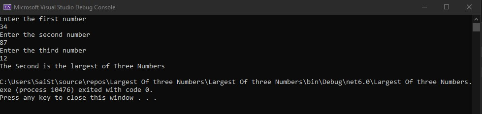

# Largest of three numbers
## Aim:
To write a C# program to find the largest of three numbers.
## Algorithm:
### Step 1:
Create a class and declare three variable with integer datatype
### Step 2:
Use if condition to check whether num1 is largest than num2 and num3
### Step 3:
Use elif condition to check whether num2 is largest than num1 and num3
### Step 4:
Use else condition to display that third variable is largest among all the variables.
## Program:
```
using System;
namespace Conditional
{
    public class Ifcondition
    {
        public static void Main(string[] args)
        {
            int num1, num2, num3;
            Console.WriteLine("Enter the first number");
            num1=Convert.ToInt32(Console.ReadLine());
            Console.WriteLine("Enter the second number");
            num2 =Convert.ToInt32(Console.ReadLine());
            Console.WriteLine("Enter the third number");
            num3 = Convert.ToInt32(Console.ReadLine());
            if(num1 > num2 && num1 > num3)
            {
                Console.WriteLine("The First is the largest of Three Numbers");
            }
            else if(num2 > num1 && num2 > num3)
            {
                Console.WriteLine("The Second is the largest of Three Numbers");
            }
            else if (num3 > num1 && num3 > num2)
            {
                Console.WriteLine("The Third is the largest of Three Numbers");
            }
            else
            {
                Console.WriteLine("All the numbers are equal");
            }
        }
    }
}
```
## Output:

## Result:
Thus the C# program to find the largest of three numbers is executed successfully.
